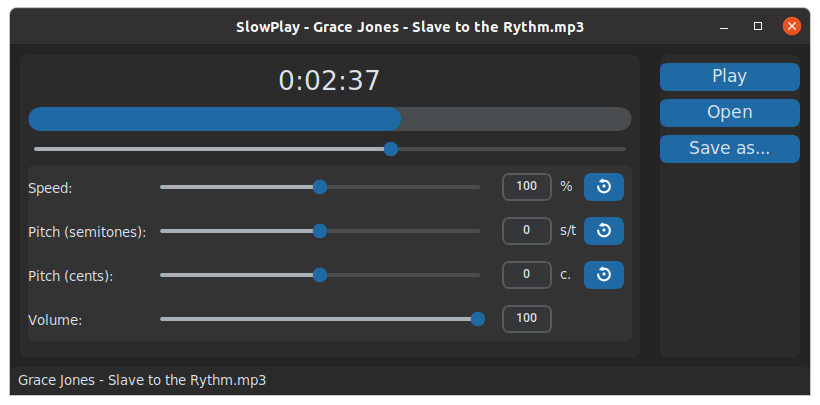

# SlowPlay

**SlowPlay** is a simple audio player with speed/pitch change capabilities, based on GStreamer. It is meant to help music students/teachers transcribe music and play along with it.

## Inspiration

This software is heavily inspired, although not forked, by [Play It Slowly](https://github.com/jwagner/playitslowly) by Jonas Wagner.

I've been using Play It Slowly as my music classes companion for ages, but unfortunately it is no longer mantained and I started experiencing problems since I've updated my laptop OS, so I decided to rewrite it.

Thank you Jonas for your work.

## Features

### Speed and pitch change
**SlowPlay** can speed down/up songs or change their pitch independently "on the fly". You can import all the most common audio files format (mp3, wav, flac, aif...). To quickly modify speed and pitch, you can use the numeric keypad shortcuts, please take a look at the shortcut list further on in this document. Slowplay supports **drag-n-drop**, thus you can drop audio files straight from your file manager or from other applications.

### YouTube audio extraction

It is possible to export modified songs by using the "Save as..." button. You can save your files either in mp3 or wav format, based on the extension of file to be saved. Currently saved audio files are in the format of 44.1K 16bit stereo. Mp3 are saved as variable bitrate quality=4. Volume setting and metadata are ignored in the export operation.

SlowPlay keeps track of the last 16 files played, and restores the playback parameters (speed, pitch, cents and volume) you set when you last played the songs. To access the recent files list use the **Ctrl+R** shortcut, or right-click on the "Open" button. If the software is launched with no media specified on the command line, it tries to re-open last played track.

## Developement

This software is my very first attempt to write "serious" Python code, so it may not look strictly pythonic to the purists, I apologize for that. I was born with C and quit my job as software developer many years ago, so not only I'm not a Python dev but I am also an obsolete dev! :)

Having said that, Slowplay is still at its early test stage, I had not the possibility to test it on many computers, so don't expect it to work on your system right out of the box. Please report problems, I can try to address them with your help.

## Installation

Currenty Slowplay is only available for the Linux operating system. To install it, please download the `slowplay[version-num].tar.gz` from the [latest release](https://github.com/aFunkyBass/slowplay/releases/latest). Extract it on a folder that can be reached by your path (tipically `/opt` or `~/.local/bin`) and run the executable file `slowplay`

### Requirements

Slowplay distributable is compiled using pyinstaller, so it should be running out of the box on most modern Linux systems as all the libraries are built-in. Please report any issues on this github.

## Shortcuts

SlowPlay offers the following shortcuts:

- **Ctrl+R**: Open recent files list
- **Ctrl+Q**: Quit application

The following commands are used to control playback and they're all assigned to the numeric keypad. Refer to the drawing below for visual help.

- **0**: Toggle Play/Pause
- **.**: Stop and Rewind

- **HOME**: Rewind

- **1**: Rewind 5 seconds
- **4**: Rewind 10 seconds
- **7**: Rewind 15 seconds

- **3**: Forward 5 seconds
- **6**: Forward 10 seconds
- **9**: Forward 15 seconds

- **8**: Increase speed by 5%
- **2**: Decrease speed by 5%
- **5**: Reset speed to 100%

- **+**: Transpose +1 semitone
- **-**: Transpose -1 semitone

*(please make sure none of the input boxes have the focus. Click on an empty area of the app to take the focus back from an input box)*:
