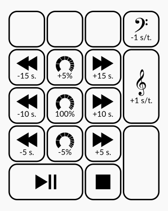

# SlowPlay

**SlowPlay** is a simple audio player with speed/pitch change capabilities, based on GStreamer. It is meant to help music students/teachers transcribe music and play along with it.

**Made by a musician for musicians**

## Inspiration

This software is heavily inspired, although not forked, by [Play It Slowly](https://github.com/jwagner/playitslowly) by Jonas Wagner.

I've been using Play It Slowly as my music classes companion for ages, but unfortunately it is no longer mantained and I started experiencing problems since I've updated my laptop OS, so I decided to rewrite it.

Thank you Jonas for your work.

## Features

- [Speed and pitch change on the fly](#speed-and-pitch-change)
- [YouTube audio extraction from URL](#youtube-audio-extraction)
- [Loop a range of the song, with fine adjustment of boundaries](#loop-ab)
- [Modified audio export in MP3 or WAV audio format](#export-modified-audio)
- [...and more!](#other-features)

### Speed and pitch change:
**SlowPlay** can speed down/up songs or change their pitch independently "on the fly". You can import all the most common audio files format (mp3, wav, flac, aif...).

Speed change is made by moving the slider which will change it in 5% steps, or by entering the precise percentage value in the edit box (eg 87%).You can transpose your song up and down by semitones or fine adjust the pitch by cents, in case the song is not in tune with your instruments. For your convenience, SlowPlay offers several numeric keypad shortcuts. Please take a look at the shortcut list further on in this document.

### YouTube audio extraction:
**SlowPlay** can extract audio from YouTube videos and treat it like a regular audio files. Please follow these steps to operate on YouTube videos:

- Click on the YouTube button to open the YouTube dialog
- Paste a valid YouTube URL in the upper box and click on the YouTube icon next to it
- The dialog will search for the specified URL and show the video info as long as its thumbnail
- If that's the video you are looking for, click on "Open" button on the dialog to import it and get back to the main window

>**Note** To enable this feature, you need install the latest version of [yt-dlp](https://github.com/yt-dlp/yt-dlp) and make sure it is present on your execution path. If `yt-dlp` is not found on your system, you will get an error.

### Loop A/B:
This function allows you to loop playback a section of the song. Please click on the "Loop control" tab to access all the loop related controls.

Use the "Set loop start" (shortcut "A") and "Set loop end" (shortcut "B") buttons while playing to mark the loop boundaries. Toggle the "Enable loop" switch (shortcut "L") to engage/disengage loop playing. You can reset the A/B point using the reset buttons or pressing "Ctrl+A" and "Ctrl+B" on your keyboard.

To achieve maximum execution precision, you can fine adjust the loop points by moving them left and right by 10 or 100 milliseconds using the associated buttons. *NOTE: Please keep in mind that there can be very short silence gap when restarting the loop. This is normal and it can't be avoided*

### Export modified audio:
It is possible to export modified songs by using the "Save as..." button. You can save your files either in mp3 or wav format, based on the extension of file to be saved. Currently saved audio files are in the format of 44.1K 16bit stereo. Mp3 are saved as constant bitrate 192k. Volume setting and metadata are ignored in the export operation.

### Other features:
- SlowPlay keeps track of the last 16 played files, and restores the playback parameters (speed, pitch, cents and volume) you set when you last played the songs. To access the recent files list use the **Ctrl+R** shortcut, or right-click on the "Open" button. If the software is launched with no media specified on the command line, it tries to re-open last played track.
- SlowPlay supports drag-n-drop to open local audio files. You can drop audio files straight from your file manager or from other applications.
- You can specify a different gstreamer sink for particular needs by supplying the **--sink** option from the command line. Example: the following command will send output to a JACK audio system `slowplay --sink jackaudiosink`

## Developement

This software is my very first attempt to write "serious" Python code, so it may not look strictly pythonic to the purists, I apologize for that. I was born with C and quit my job as software developer many years ago, so not only I'm not a Python dev but I am also an obsolete dev! :)

Having said that, Slowplay is still at its early test stage, I had not the possibility to test it on many computers, so don't expect it to work on your system right out of the box. Please report problems, I can try to address them with your help.

## Installation

To install SlowPlay please follow these simple steps:

- Download the compressed file `slowplay[version-num].tar.gz` from the [latest release](https://github.com/aFunkyBass/slowplay/releases/latest).
- Extract it on a folder present your system path (tipically `/opt` or `~/.local/bin`)
- Run the executable file `slowplay`

*NOTE: currenty Slowplay is only available for the Linux operating system.*

### Requirements

Slowplay distributable is compiled using pyinstaller, so it should be running out of the box on most modern Linux systems as all the libraries are built-in. Please report any issues on this github.

## Shortcuts
SlowPlay offers the following shortcuts:

#### General operations:
- **Ctrl+R**: Open recent files list
- **Ctrl+Y**: Open YouTube search dialog
- **Ctrl+Q**: Quit application

#### Playback controls:
The following commands are all assigned to the numeric keypad. Refer to the drawing below for visual help.

- **0** or **spacebar**: Toggle Play/Pause
- **.** *(numeric pad dot)*: Stop and Rewind

- **HOME**: Rewind to the start of song, or to the start of loop when engaged

- **1** or **left arrow**: Rewind 5 seconds
- **4**: Rewind 10 seconds
- **7**: Rewind 15 seconds

- **3** or **right arrow**: Forward 5 seconds
- **6**: Forward 10 seconds
- **9**: Forward 15 seconds

- **8**: Increase speed by 5%
- **2**: Decrease speed by 5%
- **5**: Reset speed to 100%

- **+**: Transpose +1 semitone
- **-**: Transpose -1 semitone

#### Loop controls:
- **L**: Toggle loop playing

- **A**: Sets the start loop point to the current playing position
- **Ctrl+A**: Resets the start loop point to the start of the song

- **B**: Sets the end loop point to the current playing position
- **Ctrl+B**: Resets the end loop point to the end of the song

*(please make sure none of the input boxes have the focus. Click on an empty area of the app to take the focus back from an input box)*:
